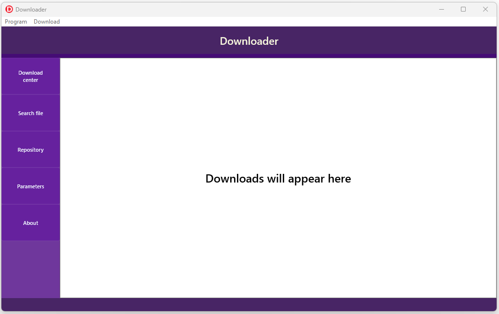

# Downloader

Firemonkey multi thread file downloader. Allow share files over local network and download files from internet.

Support:
-  Multi threading download, start, pause, abort
-  Search file based on IP adress of partner
-  Create repository with shared files

I created this software to learn more about Firemonkey platform provided by Embarcadero. No extra components needed, pure Delphi 10.4.
