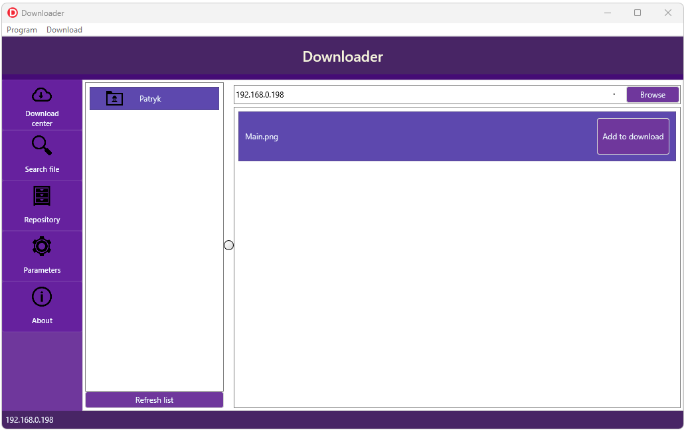

# Downloader

Firemonkey multi thread file downloader. Allow share files over local network and download files from internet.

Support:
-  Multi threading download, start, pause, abort
-  Search file based on IP adress of partner
-  Create repository with shared files
-  Simple remote desktop (view only)

Stack:
-  Information exchange based on HTTP client/server and JSON format - port 8899
-  Broadcast UDP messages for user discovery in LAN network - port 8898
-  All icons use in program from https://icons8.com/

I created this software to learn more about Firemonkey platform provided by Embarcadero. No extra components needed, pure Delphi 10.4.
